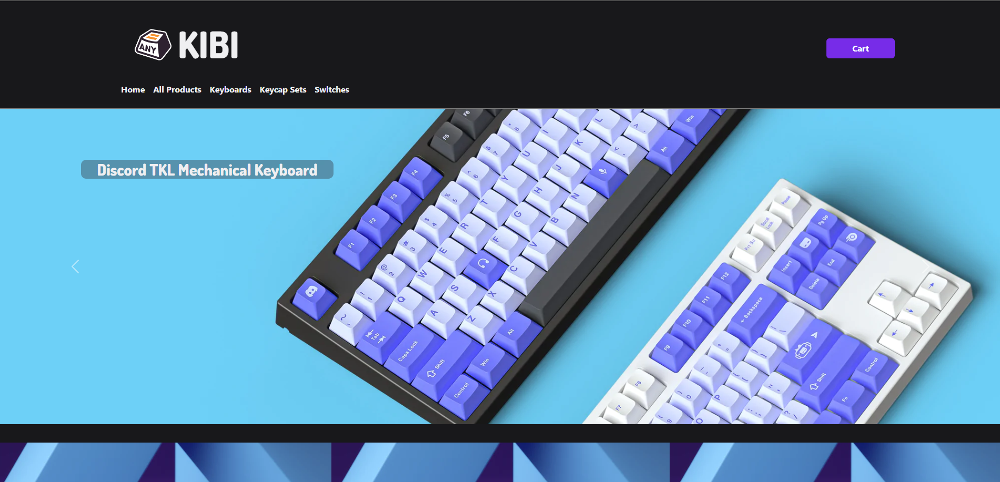
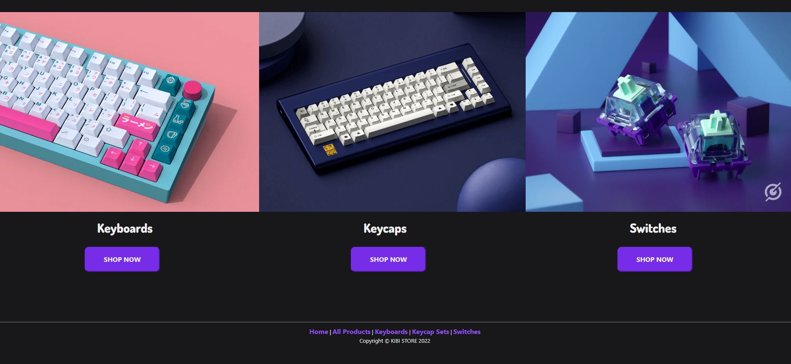
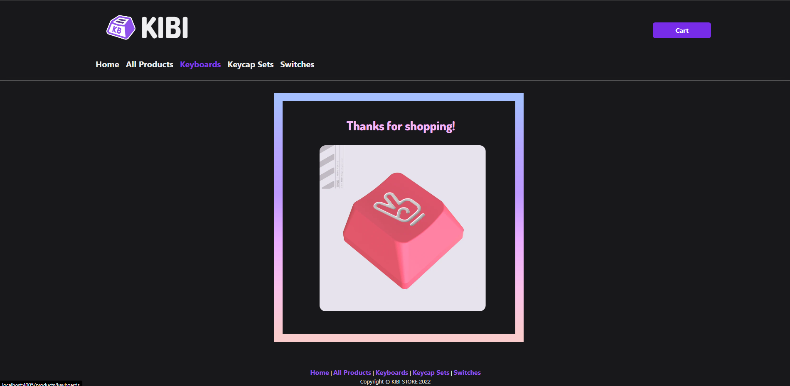

### :handbag: A simple RESTful Web App to purchase Keyboards and Keycaps on e-commerce store.

## Introduction:

"KIBI" store is a full stack, e-commerce, web application that features the 7 RESTful routes. The idea to build an awesome e-commerce store to offer various quality keyboards was born based on common hobbies of team members.

## Credits:

This application was developed by Estrella Alvarez https://github.com/estrellaalvarez, Steven Calhoun https://github.com/StevieC7, and Shorena K. Anzhilov https://github.com/ShorenaK .

## Features: 
Display all products "Keyboards & Keycaps Set".
View to display all Keyboards.
View to display all Keycap sets.
View page to show each individual product.
Edit a Keyboard & Keycap Set listings.
Create a product listing.
Delete a product listing.
Ability to add items to a cart.

## Development Tools:

The application was built with Node.js, Mongoose, Express and EJS. The file structure is compliant with the MVC & MVP formats. There are two different models, each with corresponding seed files. Some of the HTML is set up using EJS Partials. The repository is maintained on Github. The application is deployed on Heroku.

## Challenges:
- Passing more than one query paramater was challenging. We had to research methods for encoding multiple queries in the URL for parsing by a separate controller.

## Highlights:
- Adding a switches index confounded us for a few minutes, because the EJS compiler was reading "switch" as a command rather than a variable. Once we realized this and changed the variable name, the program ran as expected.

## Resources:
- Google
- Stack Overflow
- Express documentation
- mongoosejs
- developer.mozilla
- Lucidchart
- Figma

## Future Improvements:
 This application may be developed further with additions such as functionality to accept payments securely. Another improvement would be to create a community of frequent customers who would log into the app. They could have increased functionality over non-logged in users. (For example, making listing an item a function that only logged-in users can do.) Users could then benefit from coupons, or other such perks.

 ## Home Page:

## Thank You Page:

## Link to hosted application:
To see the application, click https://kibi-e-commerce.herokuapp.com/.