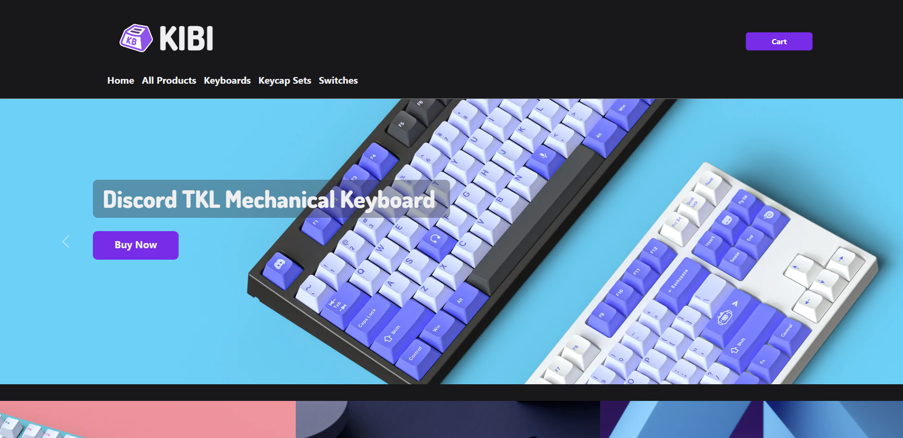

### :handbag: A simple RESTful Web App to purchase Keyboards and Keycaps on e-commerce store.

## Introduction:

"KIBI" e-commerce store is a web application that features the 7 RESTful routes. The idea to build an awesome e-commerce store to offer various great quality keyboards was born based on common hobbies of team members.

## Credits:

This development was coded and created by Estrella Alvarez https://github.com/estrellaalvarez, Steven Calhoun https://github.com/StevieC7, Shorena K. Anzhilov https://github.com/ShorenaK .

## Features: 
Display all products "Keyboards & Keycaps Set".
View to display all Keyboard.
View to display all Keycaps set.
View page to show each individual product.
Edit a Keyboard & Keycaps listing.
Create a product listing.
Delete a product listing.
Ability to add items to a cart.

## Development Tools:

The application was built with Node.js, Mongoose, Express and EJS. The file structure is compliant with the MVC & MVP formats. There are two different models, each with corresponding seed files. Some of the HTML is set up using EJS Partials. The repository is maintained on Github. The application is deployed on Heroku.

## Challenges:

## Highlights:

## Future Improvements:
 This application could be developed further with additions such as a shopping cart or functionality to accept payments securely. Another improvement would be to create a community of frequent customers who would log into the app. They could have increased functionality over non-logged in users. (For example, making listing an item a function that only logged-in users can do.) Users could then benefit from coupons, or other such perks.

 ## Home Page:

## Link to hosted application:
To see the application, click (link).

## Resourse:
 Lucid, Figma. 